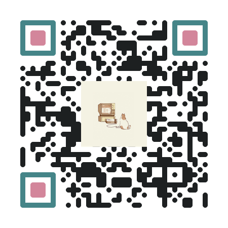

# Pretty QR Code


## Overview
Generate pretty QR codes.

Pretty QR Code uses the [python-qrcode](https://github.com/lincolnloop/python-qrcode) library to generate qr codes
and provides various options to customize the qrcode.
You can adjust style, color and add an image in the middle.
Check out the usage for all available options.

## Installation

### NixOS
This tool is packaged as a NixOS package. You might want to install it using the following flake input:

```
qr-code-generator = {
    url = "git+https://_:<access-token>@gitlab.nesto.app/nesto-software/pos-adapter-v2/qr-code-generator?ref=main";
    inputs.nixpkgs.follows = "nixpkgs";
};
```

Further, add the following to your home-manager config:

```
home-manager.users.<your-user> = {
    home.packages = [
        (qr-code-generator.packages.${system}.default.override
        {
            inherit pkgs;
        })
    ];
};
```

You might also want to add:

```
nixpkgs.config.allowUnfreePredicate = pkg: builtins.elem (lib.getName pkg) [
    "qr-code-generator"
];
```

### Contribute
#### Requirements
- Python 3
- pip
    - qrcode
    - Pillow

#### Install Dependencies
You can install the pip packages directly on your system or in a virtual environment.
1) `python -m venv qrenv` (only if you run the tool in a virtual environment)
2) `source qrenv/bin/activate` (only if you run the tool in a virtual environment)
3) `pip install qrcode`
4) `pip install Pillow`

## Usage
Pretty QR Code provides the program `qrcode-pretty`.
You have to at least provide the `-d <data to encode>` option to generate a qr code: `qrcode-pretty -d "https://github.com/mrinfinidy/pretty-qr-code"`
Use `qrcode-pretty -h` to print all available options:
```
Options:
  -h, --help                  Show this help message and exit
  -d, --data <data>           Data to encode in QR code (required)
  -i, --input <image>         Input image file name (optional)
  -s, --style <style>         Style for the QR code modules (optional)
      --style-inner <style>   Style for the inner eyes (optional)
      --style-outer <style>   Style for the outer eyes (optional)
  -b, --base <hex>            Base color hex code (e.g. #000000)
  -n, --color-inner <hex>     Inner eye color hex code
  -r, --color-outer <hex>     Outer eye color hex code
  -o, --output <dir>          Output directory path (default: ./qrcode-output/)
      --svg                   Also generate SVG output (optional flag)
      --version <int>         QR version (default: 5)
      --box-size <int>        Box size in pixels (default: 10)
      --border <int>          Border size in boxes (default: 4)
      --error-correction <L|M|Q|H>  Error correction level (default: H)

Available styles: square, gapped-square, circle, round, vertical-bars, horizontal-bars
```

### NixOS
If you installed the package into your PATH with the methods listed above, you can just run: `qrcode-pretty`
### Manual Installation
Launch script from project root directory:
`python ./qrcode-pretty`

### Samples
#### QR Code Github


`./result/bin/qrcode-pretty --data "https://github.com/mrinfinidy/pretty-qr-code" --image default --style circle --style-inner round --style-outer round --base "#000000" --color-inner "#ff7373" --color-outer "#000000" --output "~/Pictures/"`


`./result/bin/qrcode-pretty --data "https://github.com/mrinfinidy/pretty-qr-code" --image default --style round --style-inner round --style-outer round --base "#1d2021" --color-inner "#d3869b" --color-outer "#458588" --output "~/Pictures/"`


`./result/bin/qrcode-pretty --data "https://github.com/mrinfinidy/pretty-qr-code" --style round --style-inner round --style-outer round --base "#8e8ece" --color-inner "#6cf2e5" --color-outer "#40E0D0" --output "~/Pictures/"`

#### QR Code afkdev8 (my homepage)


`./result/bin/qrcode-pretty --data "https://www.afkdev8.com/" --image "~/Pictures/afkdev8-logo.png" --style vertical-bars --style-inner round --style-outer round --base "#000000" --color-inner "#000000" --color-outer "#000000" --output "~/Pictures/"`


`./result/bin/qrcode-pretty --data "https://www.afkdev8.com/" --image "~/Pictures/afkdev8-logo-dark.png" --style horizontal-bars --style-inner round --style-outer round --base "#000000" --color-inner "#000000" --color-outer "#000000" --output "~/Pictures/"`
